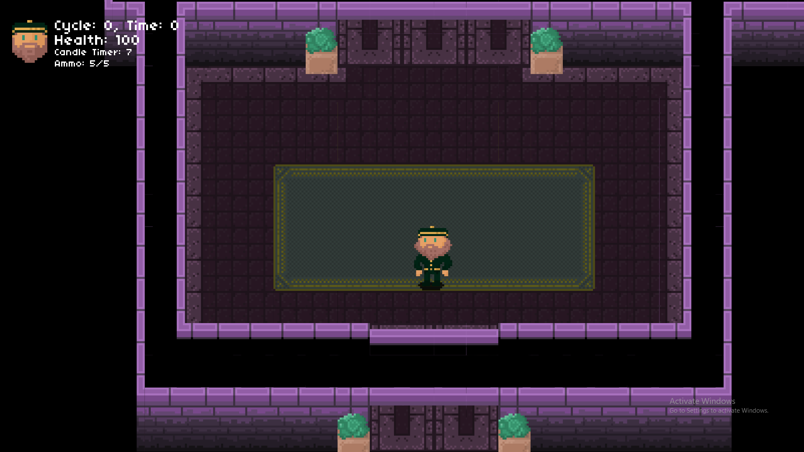
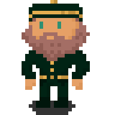
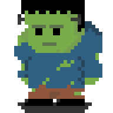
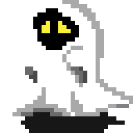
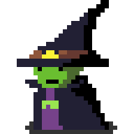

# Seance

  

A roguelike game lets you play as a bellhop in a haunted house.

### Player

- Bellhop
  - Health:
  - Speed:
  - Primary Weapon:
    - Food: The meat is the only way to keep your guests happy
  - Secondary Weapon:
    - Light: When the players vision is limited, players can turn on the the light for a certain amount of time, to expand the player's vision

### Monsters

- Frankenstein
  - Hunger:
  - Speed:
  

- Ghost
  - Hunger:
  - Speed:

- Witch
  - Hunger:
  - Speed:  

## How It Works

The player can control the bellhop which has one main ability, to throw food at food at the hotel’s guests. His guests comprise of monsters, each having a different hunger and walking speed, which are listed above. If their hunger reaches zero, the monster will become enraged. They will emit an aura around them, draining the player's sanity if they are around them. The game ends when the player's sanity reaches zero.

### Other mechanics:

On certain cycles, light would become an issue to the players, restricting what they can see. This makes it difficult for the players to find their guests, and maneuver through the hotel especially when the guests are in their “enraged” state. Players, however, have a light source which increases the player’s field of vision for a limited time, allowing players to better see their surrounding.

### Built With

- **Lua**: Scripting Language
- **Love2D**: Game Engine
- **Tiled**: Map Framework
- **Aseprite**: Sprite Editor

### Licence

This project is licensed under the MIT License

### Bugs

There are some corners in the map that doesn’t register well with the movements of the player. This causes the player to be teleported to some other parts of the map if he/she collide with the bugged corners

### Future Plans

- Create a better AI for the monsters. Currently, they just stay in their rooms but it would be best if they can roam around the halls and even possibly chase the player when the monsters are in their “enraged” state.

- Add more depth to the monsters. For example, the ghost can pass through walls when enraged.

